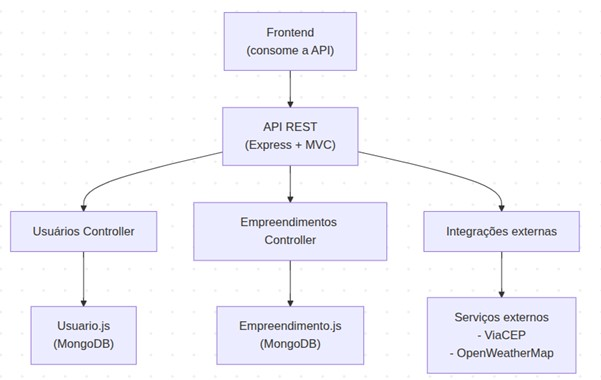

# Arquitetura do Sistema ConectaBairro

Este documento descreve a arquitetura planejada para o sistema **ConectaBairro**.  
O objetivo é apresentar de forma clara os componentes principais, os padrões arquiteturais que serão adotados, o diagrama de arquitetura e as decisões técnicas que fundamentarão o projeto.  
A arquitetura foi pensada para garantir organização, escalabilidade, segurança e facilidade de manutenção, servindo como guia para a implementação na Etapa 2.

---

## Sumário

- [Descrição da Arquitetura](#descrição-da-arquitetura)
- [Componentes do Sistema](#componentes-do-sistema)
- [Padrões Arquiteturais Utilizados](#padrões-arquiteturais-utilizados)
- [Diagrama da Arquitetura](#diagrama-da-arquitetura)
- [Decisões Técnicas e Justificativas](#decisões-técnicas-e-justificativas)

---

## Descrição da Arquitetura

O projeto ConectaBairro adotará uma arquitetura baseada no padrão MVC (Model-View-Controller), adaptada para uma API RESTful desenvolvida em Node.js com Express. A estrutura será planejada para garantir organização, escalabilidade e facilidade de manutenção. O backend será responsável por autenticação, gerenciamento de empreendimentos, integração com APIs externas e resposta em formato JSON para qualquer cliente HTTP (web ou mobile).

---

## Componentes do Sistema

| Componente                 | Descrição                                                                 |
|---------------------------|---------------------------------------------------------------------------|
| Frontend Web/Mobile       | Interface de acesso para usuários (a ser desenvolvida na Etapa 2)         |
| Backend (API RESTful)     | Responsável por autenticação, CRUD de empreendimentos e integração externa |
| Banco de Dados (MongoDB)  | Armazenará usuários, empreendimentos e dados normalizados                   |
| Serviços Externos         | Integração com ViaCEP (endereços) e OpenWeather (clima por cidade)        |
| Middleware de Autenticação| Validará tokens JWT e protege rotas sensíveis                               |
| Testes Automatizados      | Cobrirá os principais fluxos com Jest e Supertest                      |

---

## Padrões Arquiteturais Utilizados

MVC (Model-View-Controller): separação clara entre dados, lógica de negócio e rotas.

RESTful API: uso semântico dos métodos HTTP (GET, POST, PUT, DELETE) e comunicação via JSON.

Repository Pattern (implícito): abstração do acesso aos dados via Mongoose.

JWT (JSON Web Token): autenticação segura e stateless.

Modularização por responsabilidade: separação em controllers, models, routes, services, middleware, utils.

---

## Diagrama da Arquitetura

O diagrama apresentado representa a estrutura conceitual da aplicação ConectaBairro, destacando os principais componentes do sistema e suas interações. A arquitetura segue o padrão MVC (Model-View-Controller) adaptado para uma API RESTful que será desenvolvida com Node.js e Express.

### Frontend

Na parte superior do diagrama, temos o Frontend, que será desenvolvido na Etapa 2 utilizando HTML, CSS e JavaScript puro. Ele será responsável por consumir a API, enviando requisições HTTP e exibindo os dados recebidos em formato JSON. O frontend permitirá que usuários realizem buscas, cadastros e visualizações de empreendimentos e clima, com foco em responsividade no acesso web e mobile

### API REST (Express + MVC)

O núcleo da aplicação é a API RESTful, que será construída com o framework Express e organizada segundo o padrão MVC. Essa camada estará dividida em três principais controllers:

**Usuários Controller**: Gerenciará o cadastro, login e autenticação dos usuários. Estará conectado ao modelo `Usuario.js`, que define a estrutura dos dados no MongoDB.

**Empreendimentos Controller**: Responsável pelo CRUD de empreendimentos cadastrados pelos usuários. Utilizará o modelo `Empreendimento.js` para persistência dos dados.

**Integrações Externas**: Englobará os serviços que consomem APIs públicas:

- **ViaCEP**: Para preenchimento automático de endereço via CEP.

- **OpenWeatherMap**: Para exibição do clima da cidade associada ao empreendimento.

### Banco de Dados

Os dados serão armazenados em um banco MongoDB, utilizando Mongoose para modelagem e validação. Cada controller fará a interação com seu respectivo modelo para realizar operações de leitura, escrita, atualização e exclusão.

### Fluxo de Dados

O fluxo representado no diagrama segue esta lógica:

1 - O usuário interage com o frontend, que envia requisições HTTP para a API.

2 - A API REST recebe a requisição e direciona para o controller correspondente.

3 - O controller pode:

- Interagir com o MongoDB via modelos Mongoose.

- Chamar serviços externos para enriquecer os dados.

4 - A resposta é montada em formato JSON e enviada de volta ao frontend.

---

## Decisões Técnicas e Justificativas

- **Node.js** com **Express** foi escolhido pela leveza, popularidade e facilidade de modularização.

- **MongoDB** será adotado por sua flexibilidade na modelagem de dados.

- **JWT** garantirá autenticação segura sem necessidade de sessões persistentes.

- **Jest** + **Supertest** foram selecionados para testes automatizados por sua integração nativa com **Node.js**.

- Arquitetura modular permitirá que cada parte do sistema evolua separadamente, facilitando manutenção e colaboração.

- Integração com APIs públicas (**ViaCEP** e **OpenWeather**) enriquecerá os dados sem sobrecarregar o backend.

- No frontend será usado **HTML**, **CSS** e **JS** puro,  garantindo responsividade para acesso via web e dispositivos móveis.

---
