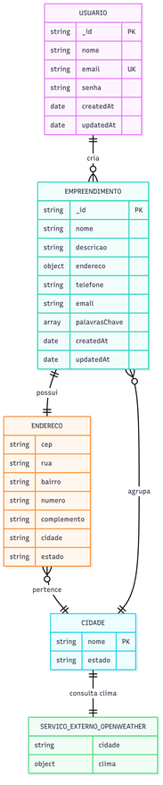

# Modelo de Dados do Sistema ConectaBairro

Este documento descreve o modelo de dados planejado para o sistema **ConectaBairro**.  
O objetivo é apresentar as entidades principais, seus relacionamentos, o diagrama ER e o dicionário de dados que servirão de base para a implementação do banco de dados.  
A modelagem foi pensada para garantir flexibilidade, integridade e escalabilidade, permitindo o gerenciamento eficiente de usuários, empreendimentos, endereços e dados climáticos integrados via APIs externas.

---

## Sumário

- [Modelo de dados](#modelo-de-dados)
- [Descrição das entidades e relacionamentos](#descrição-das-entidades-e-relacionamentos)
- [Diagrama ER ou similar](#diagrama-er-ou-similar)
- [Dicionário de dados](#dicionário-de-dados)

---

## Modelo de dados

O modelo de dados do projeto ConectaBairro foi planejado para garantir flexibilidade, integridade e escalabilidade. Utilizando MongoDB como banco de dados NoSQL e Mongoose para modelagem, a estrutura permite o gerenciamento eficiente de usuários, empreendimentos, endereços e dados climáticos integrados via APIs externas.

---

## Descrição das entidades e relacionamentos

O sistema é composto por seis entidades principais:

- USUARIO: representa os usuários da plataforma, incluindo moradores e empreendedores.

- EMPREENDIMENTO: representa os negócios cadastrados pelos usuários.

- ENDERECO: detalha a localização dos empreendimentos.

- CIDADE: centraliza dados geográficos e permite integração com serviços climáticos.

- SERVICO_EXTERNO_OPENWEATHER: armazena dados climáticos obtidos via API externa.

- Relacionamentos:

  - Cada empreendimento pertence a um usuário.

  - Cada empreendimento possui um endereço.

  - Cada endereço está vinculado a uma cidade.

  - Cada cidade pode consultar dados climáticos via serviço externo.

---

## Diagrama ER ou similar

A imagem abaixo representa visualmente o modelo de dados e os relacionamentos entre as entidades do sistema:

---

## Dicionário de dados

### USUARIO

| Campo      | Tipo   | Descrição                          |
|------------|--------|------------------------------------|
| `_id`      | string | Identificador único do usuário     |
| `nome`     | string | Nome completo                      |
| `email`    | string | Email único para login             |
| `senha`    | string | Senha criptografada                |
| `createdAt`| date   | Data de criação do registro        |
| `updatedAt`| date   | Data da última atualização         |

---

### EMPREENDIMENTO

| Campo           | Tipo    | Descrição                                      |
|-----------------|---------|-----------------------------------------------|
| `_id`           | string  | Identificador único do empreendimento          |
| `nome`          | string  | Nome do empreendimento                         |
| `descricao`     | string  | Descrição dos serviços ou produtos             |
| `endereco`      | object  | Objeto com os dados de localização             |
| `telefone`      | string  | Telefone de contato                            |
| `email`         | string  | Email de contato                               |
| `palavrasChave` | array   | Termos para facilitar busca                    |
| `createdAt`     | date    | Data de criação do registro                    |
| `updatedAt`     | date    | Data da última atualização                     |

---

### ENDERECO

| Campo         | Tipo   | Descrição                          |
|---------------|--------|------------------------------------|
| `cep`         | string | Código postal                      |
| `rua`         | string | Nome da rua                        |
| `bairro`      | string | Bairro                             |
| `numero`      | string | Número do imóvel                   |
| `complemento` | string | Complemento (opcional)             |
| `cidade`      | string | Nome da cidade                     |
| `estado`      | string | Sigla do estado                    |

---

### CIDADE

| Campo     | Tipo   | Descrição                          |
|-----------|--------|------------------------------------|
| `_id`     | string | Identificador único da cidade      |
| `nome`    | string | Nome da cidade                     |
| `estado`  | string | Sigla do estado                    |

---

### SERVICO_EXTERNO_OPENWEATHER

| Campo    | Tipo   | Descrição                                   |
|----------|--------|---------------------------------------------|
| `cidade` | string | Nome da cidade consultada                   |
| `clima`  | object | Dados climáticos (temperatura, etc)         |

---
